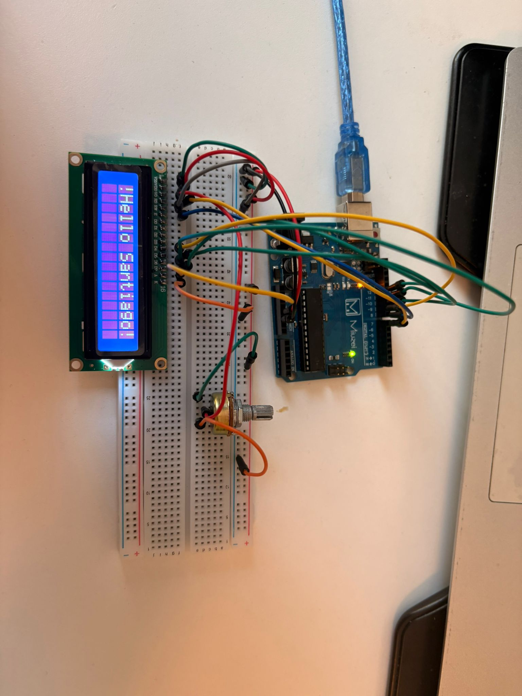
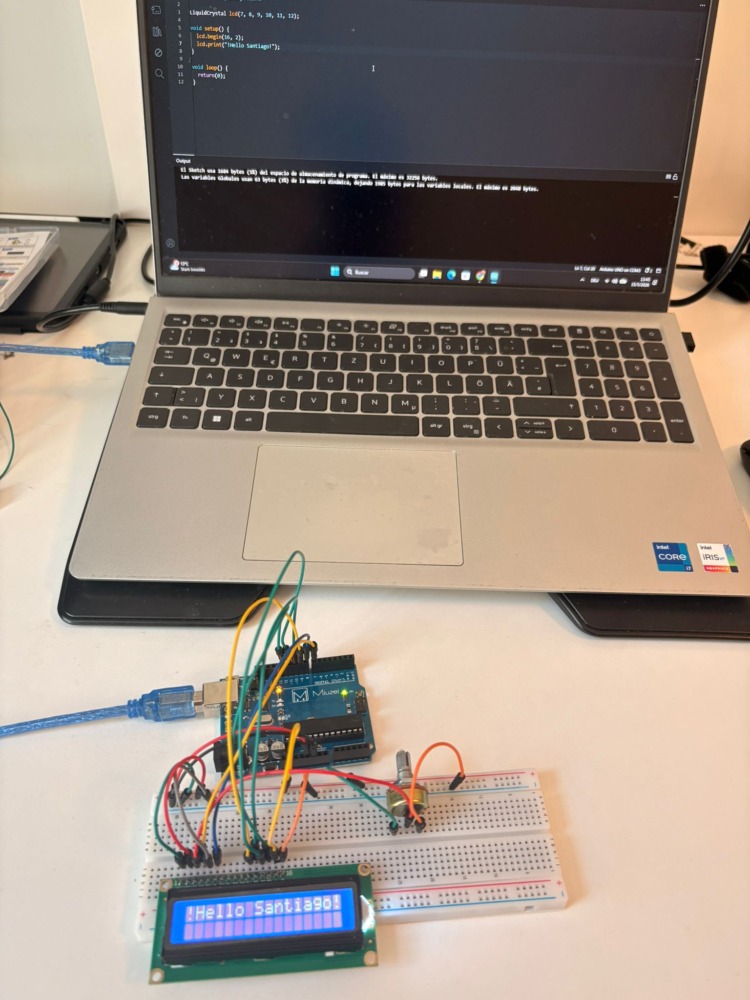

# LCD Welcome Display

Simple Arduino project using a 16x2 LCD display without I2C.

## Components
- Arduino Uno
- 16x2 LCD Display
- Potentiometer
- Breadboard
- Jumper wires

## Features
- Displays a welcome message on the LCD
- Uses the LiquidCrystal library
- Adjustable screen contrast using potentiometer

## Wiring
- RS → Pin 7
- E → Pin 8
- D4 → Pin 9
- D5 → Pin 10
- D6 → Pin 11
- D7 → Pin 12

## Code
The display prints:

```text
Hello Santiago
```
## Preview






