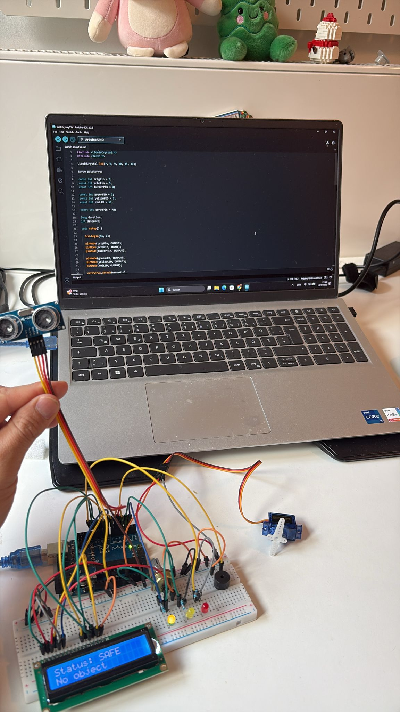
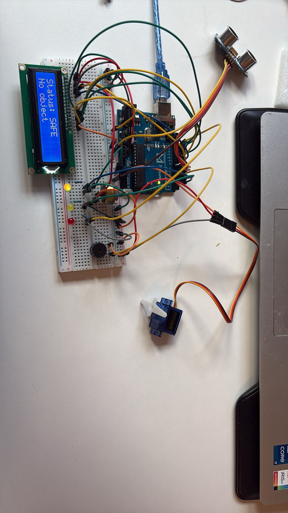

# Smart Access & Safety System

Arduino-based smart safety and access monitoring system using sensors, LEDs, buzzer, LCD display and servo motor.

## Features

- Distance detection using HC-SR04 ultrasonic sensor
- Real-time LCD status display
- LED warning system
- Audible buzzer alerts
- Servo-controlled access barrier simulation
- Embedded systems logic with multiple safety states

## Components Used

- Arduino Uno
- HC-SR04 Ultrasonic Sensor
- 16x2 LCD Display
- Servo Motor
- Buzzer
- LEDs
- Breadboard
- Resistors
- Jumper Wires

## System States

### SAFE
- Green LED
- Servo open
- No buzzer

### WARNING
- Yellow LED
- Short buzzer sound
- Servo partially closed

### TOO CLOSE
- Red LED
- Continuous alarm
- Servo closed

## Technologies

- Arduino C/C++
- Embedded Systems Basics
- Sensor Integration
- Hardware Control
- Real-time Logic Processing

## Project Structure

```text
smart-access-safety-system
├── code
├── images
├── videos
└── README.md
```

## Preview





![System Demo].(videos/smart-access-system-demo.mp4).


